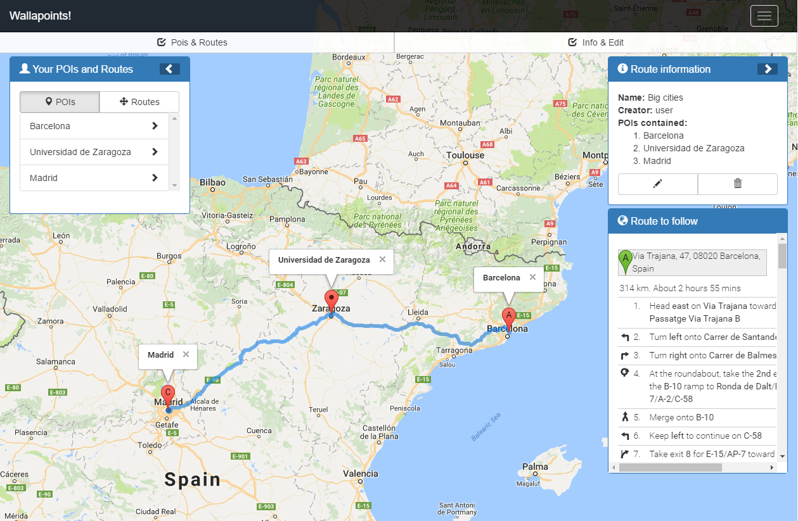

# WallaPoints

Responsive map-centered social network where users can manage POIs (Points of Interest) and routes of POIs. 
Guests can visualize all POIs and rate other users POIs, follow users, etc.
Registered users can create, modify and remove POIs and routes, and obtain statistics about their points.

Developed as a project for Web Systems and Technologies subject in University of Zaragoza, Spain.

Authors: Ismael Rodríguez (me), Sergio Soro (@teruyi), David Vergara (@davidvergara).

##Technologies
* RESTful architecture.
* AngularJS
* NodeJS + Express 
* Mongoose
* JSON Web Tokens
* Chart.js
* Bootstrap
* Mocha
* Chai

##Directories:
* **core** -> Contains the main web service and frontend.

##Files:
* **.travis.yml** -> Travis tests configuration file. 
* **Procfile** -> Heroku deploy config file.

Please read the README.md file inside "core" folder to obtain more information.
